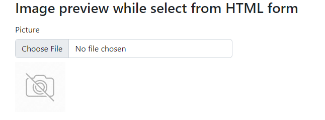

# own-ImagePreviewHTMLFormSelected

# Welcome to Image Preview Repository

I have written a code for the developers. When we select a file in a form to upload then the image is not previewed. I want to show the image while select. For that I have writen a short javascript code in the file.

```
$(function() {
	$("#fileupload").change(function() {
		//alert('ss');
		$("#dvPreview").html("");
		var regex = /^([a-zA-Z0-9\s_\\.\-:])+(.jpg|.jpeg|.gif|.png|.bmp)$/;
		if (regex.test($(this).val().toLowerCase())) {
			//alert('ss');
			if ($.browser.msie && parseFloat(jQuery.browser.version) <= 9.0) {
				$("#dvPreview").show();
				$("#dvPreview")[0].filters.item("DXImageTransform.Microsoft.AlphaImageLoader").src =
					$(this).val();
			} else {
				if (typeof(FileReader) != "undefined") {
					$("#user_image").hide();
					$("#dvPreview").show();
					$("#dvPreview").append("");
					var reader = new FileReader();
					reader.onload = function(e) {
						$("#dvPreview img").attr("src", e.target.result).css({
							'height': '100px',
							'width': '100px'
						});
					}
					reader.readAsDataURL($(this)[0].files[0]);
				} else {
					$("#user_image").show();
					alert("This browser does not support FileReader.");
				}
			}
		} else {
			$("#user_image").show();
			alert("Please upload a valid image file.");
		}
	});
});
```

# Project Preview

While you run the project, the outlook will be like:



# Hope this might help you in the development journey
